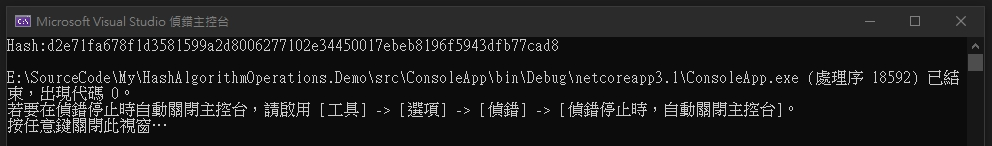
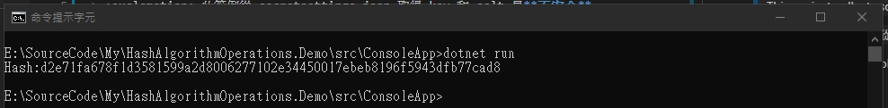
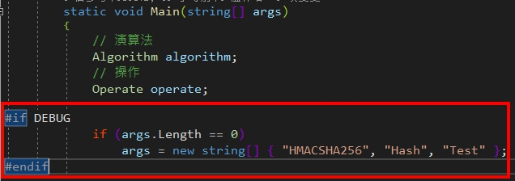
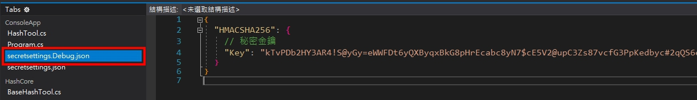
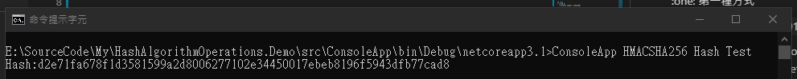
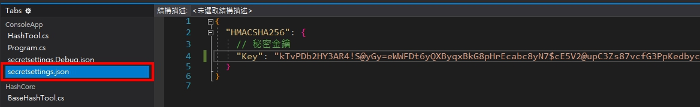

# HashAlgorithmOperations.Demo
> 這個專案收集一些實務上會需要操作到雜湊演算法的各種方式。  
> This project collects some practical ways to operate hash algorithm.

> :exclamation: 此範例從 secretsettings.json 取得 secret 是**不安全**的。  

:exclamation: This example get secret from secretsettings.json **isn't secure**.  

## 運行專案
:one: 第一種方式
> 透過 Visual Studio 2019 或者利用 `dotnet run` 指令把專案跑起來看結果。  
1. Run the project from Visual Studio 2019 or by typing `dotnet run` in a command window, then you will see the default result.  
* By Visual Studio 2019

* By Command line

> 你可以嘗試修改測試值和秘密設定！  
2. You can try to modify test value and secret settings!  



:two: 第二種方式
> 透過 Visual Studio 2019 或者利用 `dotnet build` 指令建置專案。
1. Run the project from Visual Studio 2019 or by typing `dotnet build` in a command window build the project.
> 執行命令看結果
2. execute command, then you will see the default result.
    ```
    $ cd ..\HashAlgorithmOperations.Demo\src\ConsoleApp\bin\Debug
    $ ConsoleApp HMACSHA256 Hash Test 
    ```
    
> 你可以嘗試修改秘密設定！
3. You can try to modify secret settings!  
    

## 目前提供的功能
* 透過 HMACSHA256 產生雜湊(generate hash)及雜湊驗算(hash verify)

## 最後版本
1.0.0.0 (October 17, 2020)

## 記錄
* 1.0.0.0
  * Initial Commit (初次上版)